# AI Agent for Revenue Analysis with Groq on Streamlit

## [Deployed App link here (beta)](https://revenueagentbeta.streamlit.app/)
### [Github Repo link here](https://github.com/SasySpanish/Revenue_Agent_Streamlit) 

A web-based financial analysis application powered by **llama-3.3-70b-versatile** via Groq,
built with Streamlit. Enter a company name, sector keyword, or list of ticker symbols,
and the agent automatically downloads financial data, computes fundamental revenue indicators,
generates interactive charts, and produces a written analyst report — all in one click.

---

## 📸 Screenshots


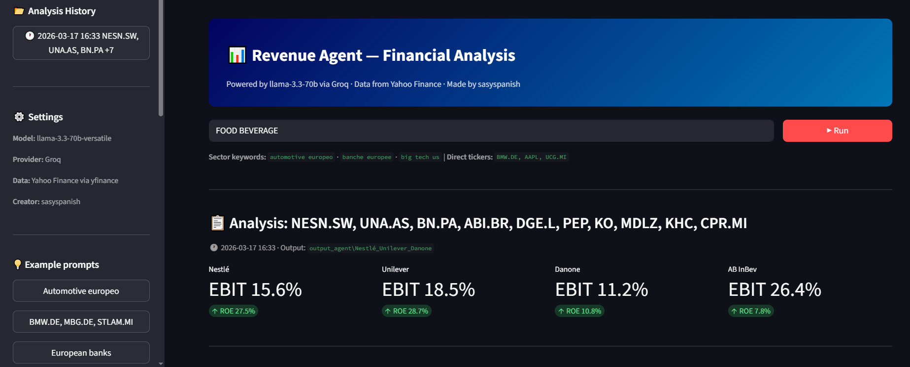

## ↓↓↓

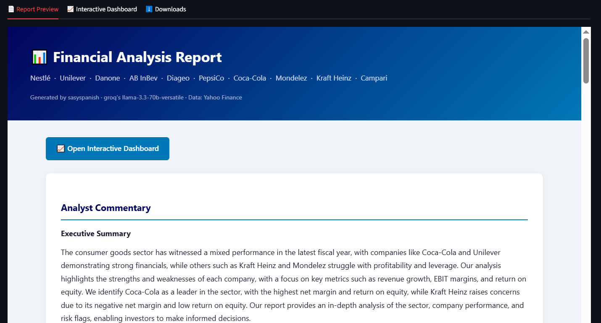

## ↓↓↓

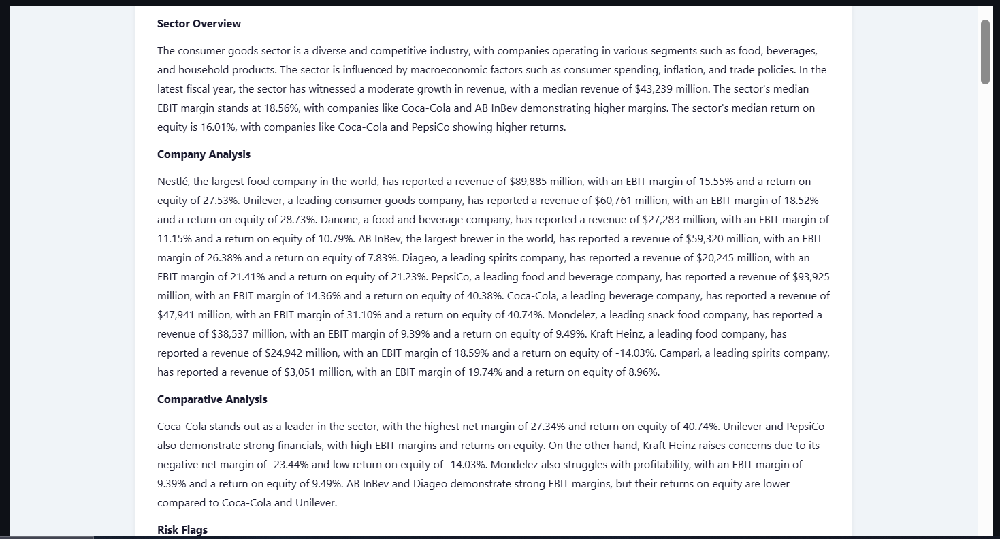

## ↓↓↓

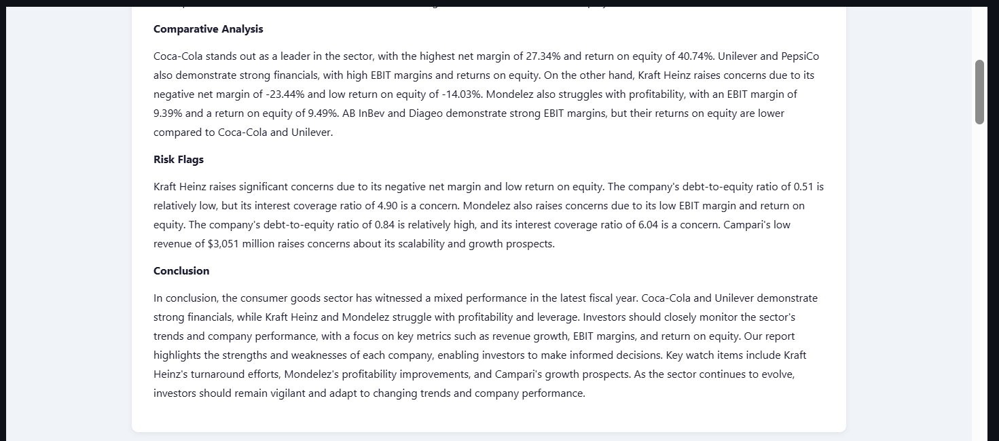

## ↓↓↓

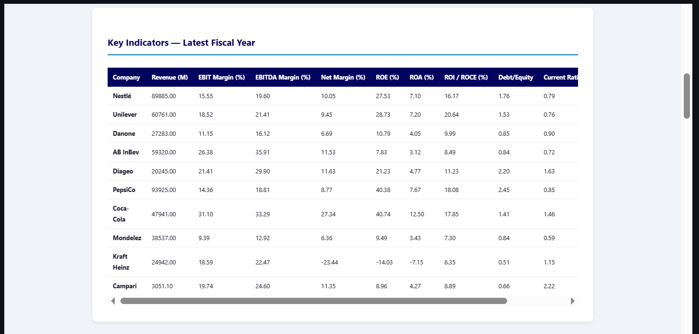

## ↓↓↓

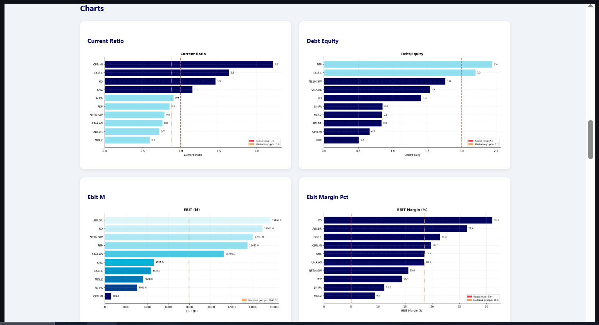

## ↓↓↓

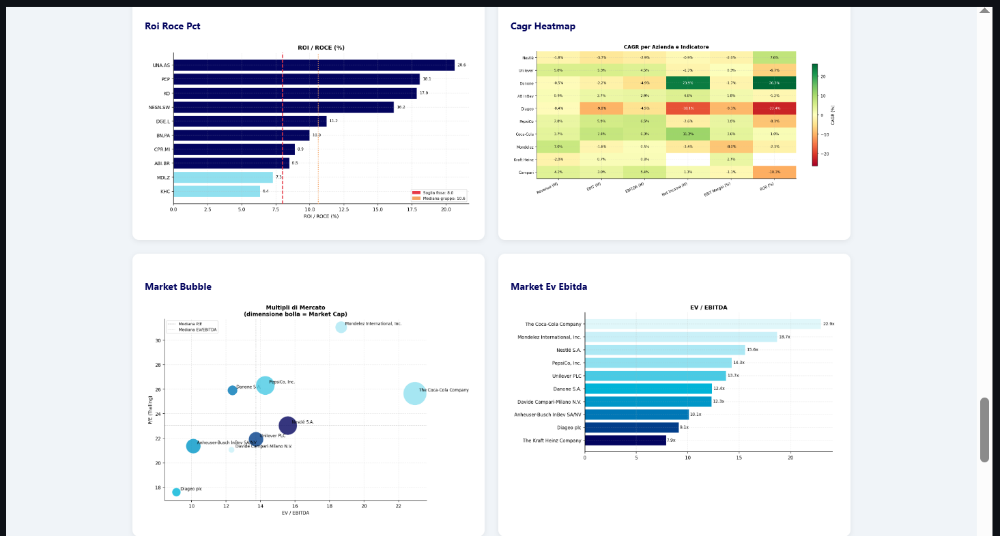

## ↓↓↓

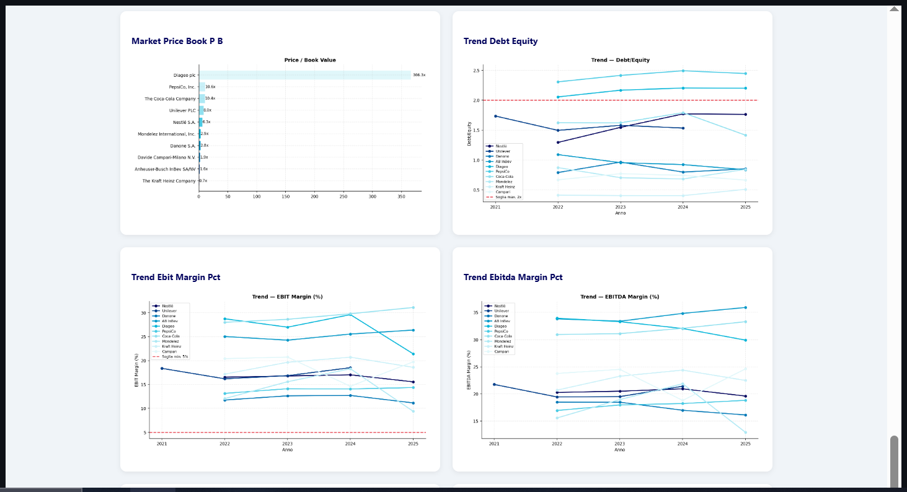

## ↓↓↓

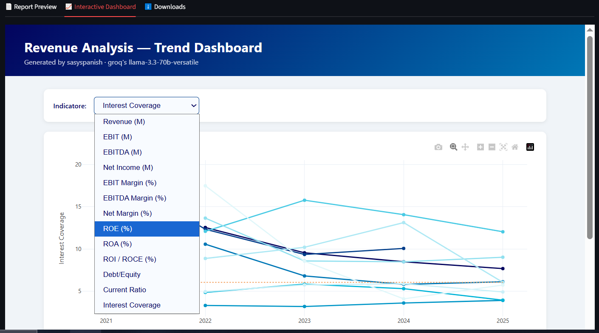

## ↓↓↓

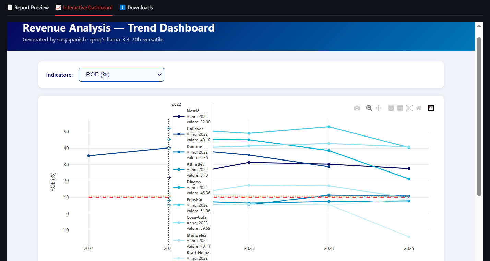

## ↓↓↓

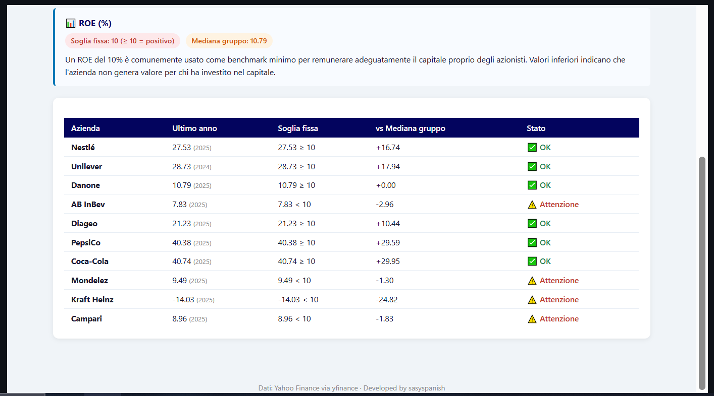

## ↓↓↓

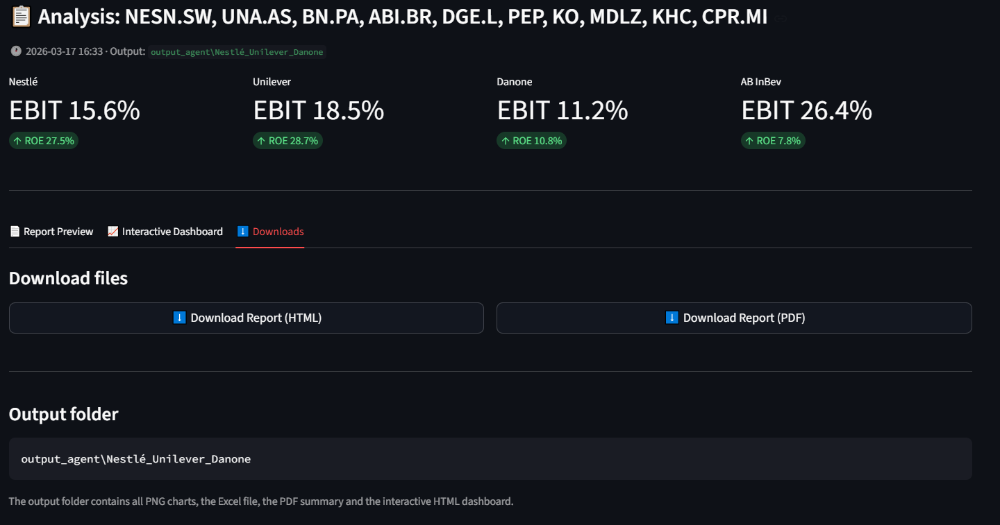

---

## What it does

1. **Resolves tickers** — maps natural language input (e.g. *"European banks"*, *"lusso"*,
   *"semiconductors"*) to valid Yahoo Finance ticker symbols using a built-in knowledge base
   covering 10+ sectors and 100+ companies
2. **Downloads financial data** — fetches income statements, balance sheets and cash flow
   statements via `yfinance`
3. **Computes indicators** — calculates 17+ fundamental indicators including EBIT, EBITDA,
   ROE, ROA, ROI/ROCE, margins, liquidity ratios, leverage and market multiples
4. **Generates charts** — produces bar charts, trend lines, CAGR heatmap and market
   multiples visualisations as PNG files
5. **Writes the report** — sends the numerical data to **llama-3.3-70b-versatile** via Groq
   and receives a structured institutional-quality analyst commentary
6. **Delivers output** — displays the full report inline in the browser with download
   buttons for HTML and PDF, plus an interactive Plotly trend dashboard

---

## Interface

The Streamlit UI includes:

- **Prompt input** — free text box accepting company names, sector keywords, or ticker symbols
- **Quick examples** — clickable sidebar buttons for 20+ preset queries
- **Progress bar** — real-time step-by-step status during the analysis pipeline
- **Report preview** — full HTML report rendered inline in the browser
- **Interactive dashboard** — Plotly trend dashboard embedded in a dedicated tab
- **Download buttons** — one-click export of the report in HTML and PDF format
- **Analysis history** — sidebar panel showing all analyses run in the current session,
  clickable to reload any previous result

---

## Project structure

```
AI-Agent-for-Revenue-Analysis-with-Groq-on-StreamLit/
├── app.py                ← Streamlit application
├── .env                  ← Groq API key (not committed)
├── .gitignore
└── requirements.txt
```

> This app depends on two companion repositories as local packages:
> - **[revenuescript](revenuescript)** — Core financial analysis
>   engine (data fetching, indicator calculation, charts)
> - **[src](src)** — Agent tool definitions
>   (ticker resolver, analysis runner, report generator)

---

## 🚀 Setup

### 1. Prerequisites
- Python 3.9+
- A free [Groq API key](https://console.groq.com)
- Both companion repos cloned and installed (see below)

### 2. Clone and install companion repos

```bash
# Core analysis engine
git clone https://github.com/YOUR_USERNAME/wheelhouse
cd wheelhouse
pip install -e .
cd ..

# Agent tools
git clone https://github.com/YOUR_USERNAME/Revenue-AI-Agent-with-Ollama-and-Langchain
```

### 3. Clone this repo and install dependencies

```bash
git clone https://github.com/YOUR_USERNAME/AI-Agent-for-Revenue-Analysis-with-Groq-on-StreamLit
cd AI-Agent-for-Revenue-Analysis-with-Groq-on-StreamLit
pip install -r requirements.txt
```

### 4. Configure paths and API key

Create a `.env` file in the root:
```
GROQ_API_KEY=your_groq_api_key_here
```

Open `app.py` and update the two path constants at the top:
```python
WHEELHOUSE_PATH = r"C:/path/to/your/wheelhouse"
GROQ_AGENT_PATH = r"C:/path/to/your/Revenue-AI-Agent-with-Ollama-and-Langchain"
```

### 5. Run the app

```bash
streamlit run app.py
```

The app will open automatically at `http://localhost:8501`.

---

## Supported input formats

| Input type | Example |
|---|---|
| Sector keyword (EN) | `European banks`, `semiconductors`, `luxury fashion` |
| Sector keyword (IT) | `banche europee`, `lusso`, `telecomunicazioni` |
| Company names | `Apple, Microsoft, Nvidia` |
| Ticker symbols | `BMW.DE, MBG.DE, STLAM.MI` |
| Mixed | `Ferrari, LVMH, Hermès` |

---

## Sector presets

| Keyword | Companies |
|---|---|
| `automotive europeo` | VW, Stellantis, Mercedes, BMW, Renault, Porsche, Volvo Cars, TRATON, Iveco |
| `banche europee` | UniCredit, Intesa, BNP, Santander, Deutsche Bank, HSBC, Barclays, SocGen, ING |
| `big tech us` | Apple, Microsoft, Alphabet, Amazon, Meta, Nvidia |
| `semiconductors` / `chips` | Nvidia, TSMC, ASML, Intel, AMD, Broadcom, Qualcomm, STMicro, Infineon |
| `pharma` / `healthcare` | Eli Lilly, Novo Nordisk, AbbVie, Roche, Novartis, AstraZeneca, Sanofi, Pfizer |
| `telecomunicazioni` / `telecom` | AT&T, Verizon, Deutsche Telekom, Vodafone, Orange, Telefonica, Telecom Italia |
| `aerospace defense` / `difesa` | Boeing, Airbus, Lockheed Martin, Raytheon, BAE Systems, Leonardo, Safran, Thales |
| `food beverage` | Nestlé, Unilever, Danone, AB InBev, Diageo, PepsiCo, Coca-Cola, Campari |
| `lusso` / `luxury` | LVMH, Hermès, Kering, Richemont, Ferrari, Moncler, Brunello Cucinelli, Burberry |
| `asset management` / `fintech` | BlackRock, Blackstone, Goldman Sachs, Visa, Mastercard, PayPal, FinecoBank |
| `ftse mib` / `italia` | Enel, Eni, UniCredit, Intesa, Ferrari, Generali, Moncler, Mediobanca, Prysmian |

---

## Financial indicators computed

| Category | Indicators |
|---|---|
| **Absolute** | Revenue, Gross Profit, EBIT, EBITDA, Net Income, Net Debt |
| **Margins** | Gross Margin, EBIT Margin, EBITDA Margin, Net Margin |
| **Returns** | ROE, ROA, ROI / ROCE |
| **Liquidity** | Current Ratio, Quick Ratio |
| **Structure** | Debt/Equity, Interest Coverage |
| **Market** | P/E, EV/EBITDA, Price/Book, Market Cap, Beta, Dividend Yield |
| **Growth** | CAGR for key indicators over available history |

---

## Output files

Each analysis run saves a dedicated folder inside `output_agent/`:

```
output_agent/
└── Apple_Microsoft_NVIDIA/
    ├── report.html                    ← full report with embedded charts
    ├── report.pdf                     ← discursive analyst commentary
    ├── trend_dashboard.html           ← interactive Plotly dashboard
    ├── automotive_analysis.xlsx       ← raw indicators (Excel)
    ├── automotive_analysis_charts.pdf ← all charts in one PDF
    └── charts/
        ├── bar_*.png                  ← per-indicator comparison
        ├── trend_*.png                ← multi-year trend lines
        ├── cagr_heatmap.png           ← CAGR heatmap
        └── market_*.png              ← market multiples
```

---

## LLM model

| Property | Value |
|---|---|
| Model | `llama-3.3-70b-versatile` |
| Provider | [Groq](https://console.groq.com) |
| Plan | Free tier (~14,400 requests/day) |
| Used for | Report commentary generation |

---

## Notes

- Data is sourced from Yahoo Finance via `yfinance` for **educational / personal use only**
- Absolute values are expressed in **millions** in the original reporting currency
- The analysis pipeline is deterministic — the LLM is used only for the written commentary
- The app runs entirely **locally** — no cloud deployment required

---

## Related repositories

| Repo | Role |
|---|---|
| [wheelhouse](https://github.com/YOUR_USERNAME/wheelhouse) | Core financial analysis engine |
| [Revenue-AI-Agent-with-Ollama-and-Langchain](https://github.com/YOUR_USERNAME/Revenue-AI-Agent-with-Ollama-and-Langchain) | Terminal agent (Ollama / local LLM) |
| [wheelhouse-agent-groq](https://github.com/YOUR_USERNAME/wheelhouse-agent-groq) | Terminal agent (Groq / llama-3.3-70b) |

---

## Roadmap

- [X] Unified single-repo structure for cloud deployment
- [X] Streamlit Cloud / Render deploy
- [ ] Conversational memory across prompts
- [ ] Web search integration for real-time news context
- [ ] Competitor auto-discovery
- [ ] Portfolio analysis mode
- [ ] Machine learning models
- [ ] Price analysis

---

## Author
Developed by **[Salvatore Spagnuolo](https://github.com/SasySpanish)**  

---

